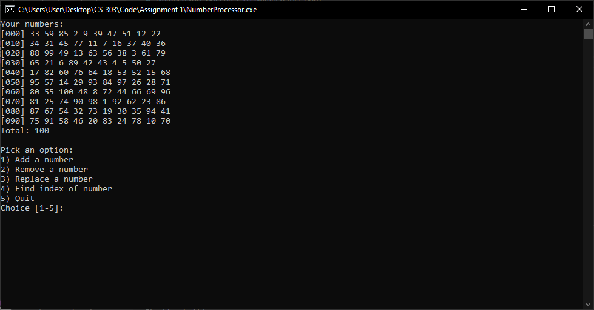
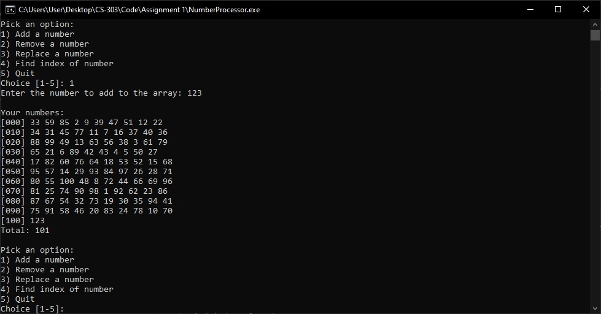
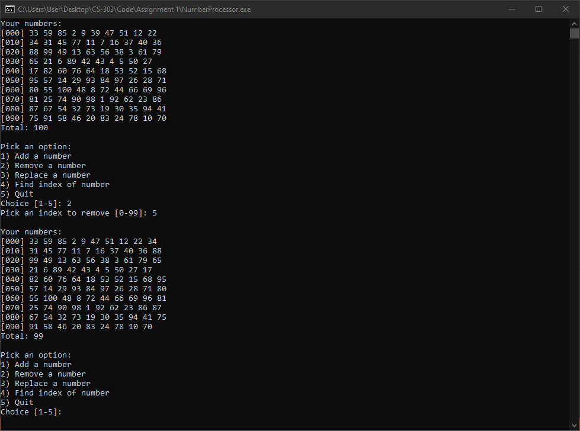
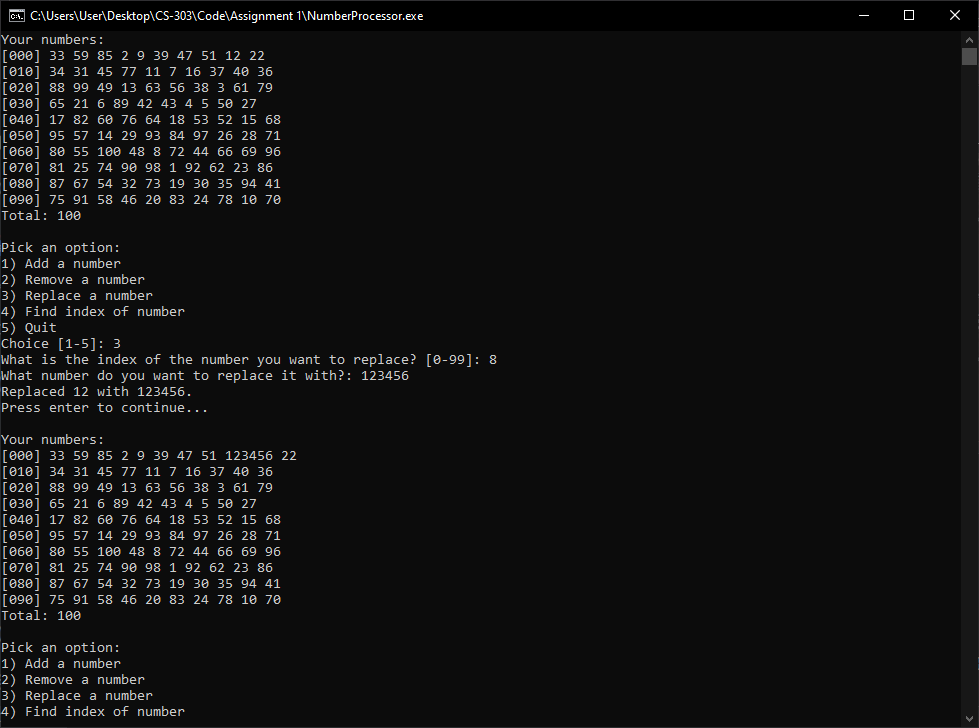
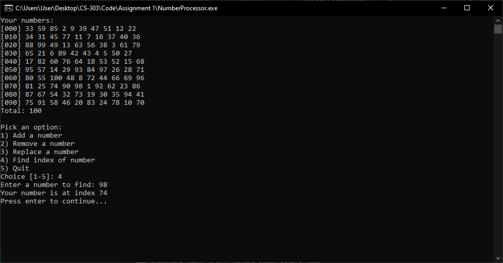

# Assignment 1
This was developed in Visual Studio Code. A task is already setup for running the code if you are using Windows. If you are using Windows, you can run this code in Visual Studio Code by:

* Installing Visual Studio C++ Build Tools
* Open a Visual Studio Developer Command Prompt
* Setting your current working directory to the directory that contains the `NumberProcessor.cpp` file.
* Running `code .`
* Installing the C++ extension from the extension marketplace.
* Opening the `NumberProcessor.cpp` file and selecting `Run -> Start Debugging` using the menu at the top of the screen.

Or you can just compile and run the `NumberProcessor.cpp` file in whatever IDE you want.

# Screenshots
### Main menu

### Adding a number to the end of the array

### Removing a number at a specified index

### Replacing a number at a specified index

### Finding the index of a number
