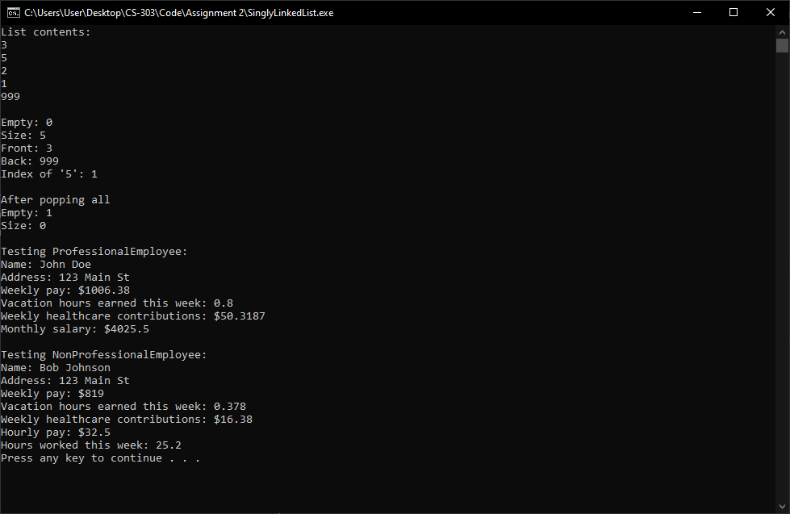

# Assignment 2
This was developed in Visual Studio Code. A task is already setup for running the code if you are using Windows. If you are using Windows, you can run this code in Visual Studio Code by:

* Installing Visual Studio C++ Build Tools
* Open a Visual Studio Developer Command Prompt
* Setting your current working directory to the directory that contains the `Test.cpp` file.
* Running `code .`
* Installing the C++ extension from the extension marketplace.
* Opening the `Test.cpp` file and selecting `Run -> Start Debugging` using the menu at the top of the screen.

Or you can just compile and run the `Test.cpp` file in whatever IDE you want.

# Screenshots
### Test output

